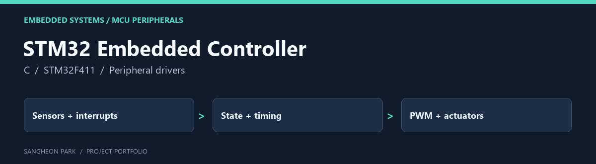

# STM32 Embedded Controller

An embedded-controller coursework archive covering low-level peripheral exercises and sensor/actuator integration in an RC car and a two-board recycling prototype.

[Portfolio home](https://github.com/oldprize47-SH) · [Original repository](https://github.com/oldprize47/Embbadded_Controller_2024)

[Original project README](README.original.md)

## Contribution and context

The individual labs and team projects have different authorship scopes. My coursework covered peripheral configuration and motor/sensor exercises; the RC car and recycling system are team work. Course-library and partner contributions remain credited by their source history.

## Code map

| Entry | Purpose |
|---|---|
| [LAB/LAB_PWM_DCmotor_21800275_SangheonPark.c](LAB/LAB_PWM_DCmotor_21800275_SangheonPark.c) | PWM and DC-motor exercise |
| [LAB/LAB_Timer_InputCaputre_Ultrasonic_21800275_SangheonPark.c](LAB/LAB_Timer_InputCaputre_Ultrasonic_21800275_SangheonPark.c) | Ultrasonic timing through input capture |
| [LAB/LAB_RC_Final.c](LAB/LAB_RC_Final.c) | RC-car sensing, state and motor output |
| [LAB/final_first_board.c](LAB/final_first_board.c) | First board of the team final project |
| [LAB/final_second_board.c](LAB/final_second_board.c) | Second board of the team final project |
| [lib](lib) | Course peripheral helpers |

## What to inspect

Trace a sensor input through its interrupt or polling path, then follow the state
and PWM output. Compare the individual labs with the integrated final projects.

[Recycling-system team demo](https://www.youtube.com/watch?v=dkphMHEKzxE)

## Verification boundary

This public archive does not contain the complete board build configuration.
A related local RC-car workspace compiled on 2026-09-28, but that result is **not**
claimed for this different source snapshot. This fork has not been freshly built,
flashed or exercised on hardware. Board support, original wiring and the course
library/toolchain must be reconciled before attempting a hardware replay.

## Archive policy

The fork retains upstream history, source attributions and course material. The
portfolio documentation does not assign a new licence or claim sole authorship
of inherited code. Current checks are stated above; an untested component is not
presented as verified.
