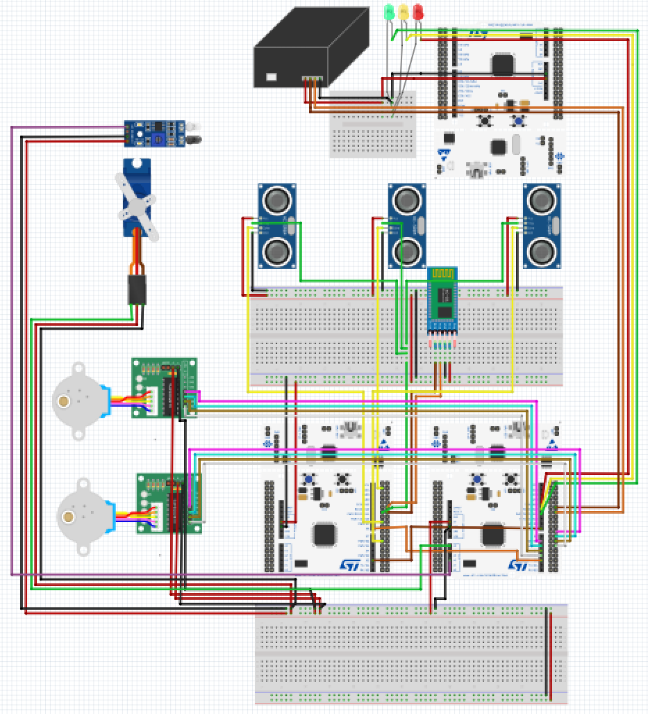
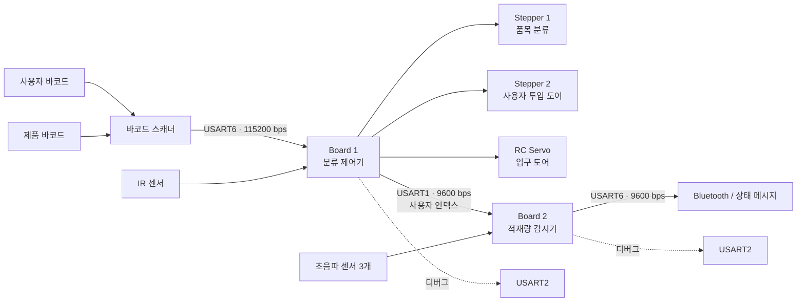

# Automatic Recycling System

**A two-board STM32 prototype that connects barcode input, sorting doors and bin-level monitoring.**

| Part | What it does |
|---|---|
| **Board 1** | Barcode input, sorting actuators and deposit detection |
| **Board 2** | Ultrasonic fill-level sensing and status messages |
| **Team outcome** | Integrated course prototype; original demonstration linked below |

**Ownership:** joint coursework; individual module ownership is not asserted. This curated repository remains private.



## Detailed project record / 상세 기록

# STM32 자동 분리수거 시스템

STM32F411RE 기반 제어기 두 대가 바코드 입력, 분류 도어 구동, 투입 완료 감지, 적재량 측정, 사용자 포인트 갱신과 만재 알림을 분담하는 임베디드 시스템입니다. 2024년 임베디드 제어 과목에서 **2인 팀**으로 제작한 결과물을 포트폴리오에 맞게 재구성했습니다.

> 이 저장소는 최종 응용 로직과 그 로직이 참조하는 최소 course/shared support 소스를 보존한 **소스 아카이브**입니다. STM32Cube/CMSIS, startup, linker script와 원래 IDE 프로젝트가 없으므로 현재 상태를 독립 빌드 가능하다고 주장하지 않습니다.

> course/shared support와 공동 코드의 공개 재배포 권한을 다시 확인하기 전까지 전체 소스 저장소는 **비공개**로 유지합니다. 공개 프로필에는 비식별 회로도, 역할·구조·한계와 팀 공개 영상 링크만 표시합니다.


## 핵심 기능

- 사용자 바코드와 재활용품 바코드를 UART로 순차 수신
- 등록 사용자 확인과 품목별 분류 상태 결정
- 2개의 스테퍼 모터와 1개의 RC 서보로 분류 경로/투입 도어 제어
- IR 센서로 투입 완료 확인
- 두 MCU 사이에서 사용자 인덱스 전달
- 3개의 초음파 센서로 재활용함 적재 상태 측정
- 사용자 포인트 갱신 및 Bluetooth/UART 만재 메시지 전송

## 시스템 구조



### 보드별 역할

| 구분 | Board 1: 분류 제어기 | Board 2: 적재량 감시기 |
|---|---|---|
| 주 입력 | 사용자/제품 바코드, IR 센서 | Board 1 사용자 인덱스, 초음파 Echo 3채널 |
| 핵심 처리 | 사용자 확인, 품목 분류, 상태 전이 | 비행시간 기반 거리 계산, 포인트/만재 상태 갱신 |
| 출력 | LED, 스테퍼 2개, 서보 1개 | Bluetooth/UART 메시지, 초음파 Trigger |
| MCU 간 통신 | USART1 송신 | USART1 수신 |
| 응용 파일 | `firmware/board-1/app/main.c` | `firmware/board-2/app/main.c` |
| support 변형 | `firmware/board-1/support/` | `firmware/board-2/support/` |

두 `support` 디렉터리는 같은 함수 이름을 가진 서로 다른 수업용 HAL 변형입니다. 한 target에 섞으면 안 됩니다.

## 하드웨어 구성

당시 제출 자료에 기록된 주요 구성은 다음과 같습니다. 수량과 정확한 부품 revision은 이번 저장소 정리 과정에서 실물로 다시 검증하지 않았습니다.

| 분류 | 구성 |
|---|---|
| MCU | NUCLEO-F411RE 계열 보드 2대 |
| 입력 | UART 바코드 스캐너, 반사형 IR 센서 |
| 거리 센서 | HC-SR04 계열 초음파 센서 3개 |
| 구동기 | 28BYJ-48 계열 스테퍼 모터 2개, SG90 계열 서보 1개 |
| 상태 표시 | 적색/황색/녹색 LED |
| 통신 | MCU 간 UART, Bluetooth 직렬 모듈, 디버그 UART |

## 소프트웨어 구성

- Bare-metal C
- GPIO, ADC, PWM, SysTick, 일반 타이머와 input capture
- USART1/2/6 인터럽트 및 polling 혼합
- 수업용 STM32F4 support layer
- STM32F411RE/CMSIS 레지스터 정의에 의존

## 핀맵

핀은 공개본의 응용 코드와 포함된 support 구현을 기준으로 정리했습니다. 실제 배선 전에는 사용 보드 revision과 회로 연결도를 다시 대조해야 합니다.

### Board 1

| 기능 | 핀/주변장치 | 설정 |
|---|---|---|
| RC 서보 PWM | `PA0` | `PWM_init`, 도어 구동 |
| 적색/황색/녹색 LED | `PA5`, `PA6`, `PA7` | GPIO 출력 |
| IR 센서 | `PB0` | ADC 입력 |
| Stepper 1 | `PB10`, `PB4`, `PB5`, `PB3` | 4상 출력 |
| Stepper 2 | `PB2`, `PB1`, `PB15`, `PB14` | 4상 출력 |
| MCU 간 UART | USART1: `PA9` TX, `PA10` RX | 9600 bps |
| 디버그 UART | USART2: `PA2` TX, `PA3` RX | 115200 bps |
| 바코드 스캐너 | USART6: `PA11` TX, `PA12` RX | 115200 bps |

### Board 2

| 기능 | 핀/주변장치 | 설정 |
|---|---|---|
| 초음파 Trigger | `PA8` | PWM pulse |
| Echo 1 | `PB6` / TIM4 CH1·CH2 | 상승/하강 edge capture |
| Echo 2 | `PB8` / TIM4 CH3·CH4 | 상승/하강 edge capture |
| Echo 3 | `PB10` / TIM2 CH3·CH4 | 상승/하강 edge capture |
| MCU 간 UART | USART1: `PA9` TX, `PA10` RX | 9600 bps |
| 디버그 UART | USART2: `PA2` TX, `PA3` RX | support 기본값 사용 |
| Bluetooth UART | USART6: `PA11` TX, `PA12` RX | 9600 bps |

> Board 2 원 코드의 한 주석에는 Trigger가 `PA6`으로 적혀 있지만 실제 매크로와 초기화 대상은 `PA8`입니다. 이 문서는 실행 코드인 `PA8`을 기준으로 합니다.

## 저장소 구조

```text
.
├─ firmware/
│  ├─ board-1/
│  │  ├─ app/main.c
│  │  └─ support/          # Board 1 전용 최소 course/shared support
│  └─ board-2/
│     ├─ app/main.c
│     └─ support/          # Board 2 전용 최소 course/shared support
├─ docs/
│  ├─ images/circuit-diagram.png
│  └─ 기술-요약.md
├─ ATTRIBUTION.md
├─ BUILDING.md
├─ NOTICE.md
└─ README.md
```

## 빌드 경계

현재 저장소에는 다음 요소가 없습니다.

- STM32CubeF4/CMSIS 전체 패키지
- `startup_stm32f411xe.s`
- `system_stm32f4xx.c`
- STM32F411RE linker script
- 원래 Keil/STM32CubeIDE 프로젝트와 확정된 toolchain version
- 재현 가능한 build command와 hardware-in-the-loop fixture

따라서 새 환경에서의 컴파일·링크 성공, 보드 flashing, 센서/모터 동작은 검증되지 않았습니다. 필요한 target 분리와 외부 의존성은 [BUILDING.md](BUILDING.md)에 정리했습니다.

## 개인정보 치환

- 원 prototype의 사용자 바코드와 사용자 이름은 공개본에 포함하지 않았습니다.
- 사용자 fixture는 synthetic 값과 `User0`~`User9` 형태로 치환했습니다.
- 품목 분류 예시용 제품 EAN fixture는 응용 로직 설명을 위해 유지했습니다.
- 원 보고서, 학번, 학생 실명, 제3자 매뉴얼, 원본 Fritzing 부품 SVG는 포함하지 않았습니다.
- support 주석의 학생 개인 이름은 역할 기반 표기로 치환했으며, 기능 코드는 바꾸지 않았습니다.

## 검증 범위

이번 정리에서 수행한 검증:

- 보드별 include closure와 support 변형 분리
- 원 사용자 바코드/학생 식별자/금지 문자열 부재 검사
- 모든 텍스트 파일 UTF-8 decode, replacement character와 반복 `?` 손상 검사
- 회로 이미지 형식·크기와 저장소 파일 목록 확인
- `python -m unittest discover -s tests -p "test_*.py"`로 파일 수, include closure, 학생 식별자·이름과 손상된 선언의 회귀 검사

수행하지 않은 검증:

- 새 toolchain에서의 compile/link
- MCU flashing 및 실물 재동작
- 센서 calibration과 거리 정확도 측정
- 모터/서보 안전 동작 재시험

## 알려진 한계

- 사용자/제품 매핑이 firmware 상수로 고정되어 있습니다.
- 일부 제어 경로가 blocking delay를 사용합니다.
- 두 보드 간 payload는 1-byte 사용자 인덱스이며 framing, checksum, freshness 정보가 없습니다.
- 초음파 측정은 온도 보상과 센서 간 간섭 억제 기능을 포함하지 않습니다.
- course/shared support 코드의 정확한 라이선스가 확인되지 않았습니다.

## 데모 영상

- [Automatic Recycle Bin 데모 영상](https://www.youtube.com/watch?v=dkphMHEKzxE)
- 외부 팀원 채널에 게시된 공동 프로젝트 영상입니다. 이 저장소는 영상을 복제하거나 단독 소유를 주장하지 않고 링크만 제공합니다.

## 공동 작업과 권리 경계

이 시스템은 2인 팀 프로젝트입니다. 응용 로직, 시스템 통합, 보고서와 미디어에는 공동 기여가 포함되어 있으며 단독 저작을 주장하지 않습니다. course/shared support 파일의 출처 분류는 [ATTRIBUTION.md](ATTRIBUTION.md), 재사용 제한은 [NOTICE.md](NOTICE.md)를 확인하세요. 이 저장소는 기존 권리자가 부여하지 않은 새 라이선스를 만들지 않습니다.
