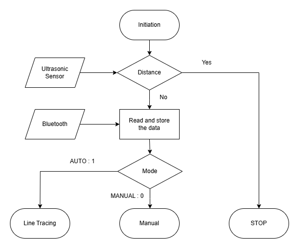

# STM32 Embedded Controller

This repository contains STM32F411 peripheral exercises and two projects from the 2024 Embedded Controller course: a line-following RC car and an automatic recycling system. The work connects GPIO, timers, PWM, sensor inputs and serial communication to physical mechanisms controlled in C.

## Project goal

Build embedded programs that connect sensor inputs to physical actions, culminating in an RC car and a recycling-bin prototype.


AI-generated concept illustration. Device appearance, interface layout and example graphics are illustrative, not project photographs or measured results.

## Where it could be used

The RC car is a small platform for teaching path following, manual control and obstacle-stop behaviour. Its sensor-to-state-to-motor sequence can also serve as a starting point for a guided mobile-robot exercise. The recycling project provides a second example of the same embedded skills in a stationary mechanism. These are classroom prototypes; adapting them to a working facility would require a different level of hardware and reliability testing.

## From peripheral exercises to a working prototype

The earlier labs isolate one part of the microcontroller at a time. GPIO and external interrupts handle switches and simple outputs. Timers provide repeatable timing, PWM changes the motor command, and input capture measures the duration of an ultrasonic sensor's echo pulse. The later projects combine these functions, so a sensor reading affects the program's state and then the actuator output.

This progression is the useful way to read the archive: begin with an individual peripheral exercise, then look at how the same kind of input or output appears in the RC car or recycling system. The support functions in [lib](lib) include course material as well as work used in the assignments.

## Project configuration and team

### Line-following RC car


[Vector diagram](docs/flowcharts/rc-car.svg)

The RC car combines two DC motors, infrared reflectance sensors, an ultrasonic sensor and Bluetooth commands. Manual mode provides movement and speed commands. Automatic mode uses the left/right reflectance measurements to follow a line, with the ultrasonic input providing the obstacle-stop condition. The program is in [LAB_RC_Final.c](LAB/LAB_RC_Final.c).

The report separates the program into an overall flow and two mode-specific flows. The overview places the obstacle-stop decision before normal movement. When movement is allowed, Bluetooth input selects manual or automatic operation. In manual mode, commands update direction, speed or steering; in automatic mode, the difference between the left and right infrared readings selects a steering state. The selected state is converted into motor duty commands.



The overview's “Distance” decision represents the obstacle condition. It is a simplified report diagram: the source performs sensor, communication and motor updates through interrupt handlers, rather than executing every box as a single blocking sequence. The report also includes the [manual-mode flow](docs/images/rc-flow-manual.png) and [line-following flow](docs/images/rc-flow-auto.png).

Sangheon Park implemented manual control and line following. 김찬중 arranged the hardware layout and wiring. Both members developed the stopping behaviour and repeatedly adjusted the car during driving tests, where sensor readings and motor commands needed to be checked together. Obstacle detection was part of this shared development; its individual attribution has not been confirmed.

### Automatic recycling system


[Vector diagram](docs/flowcharts/recycling.svg)

The recycling system recognises a user and item from barcode information, selects a sorting path, opens the doors, detects the deposit and reports completion. Two controllers divide the deposit mechanism from bin-level and status monitoring. The applications are in [final_first_board.c](LAB/final_first_board.c) and [final_second_board.c](LAB/final_second_board.c).

방준혁 developed barcode-based member and recyclable-category recognition and UART transmission. Sangheon Park developed the deposit and sorting sequence, including the stepper motors, servo entrance and infrared deposit detection. He also handled ultrasonic fullness detection, user points, Bluetooth messages and LED status indication. Both members assembled the mechanism, connected the boards and tested the complete prototype.

[Watch the recycling system demonstration](https://www.youtube.com/watch?v=dkphMHEKzxE).

### Peripheral exercises and shared support


[Vector diagram](docs/flowcharts/embedded-labs.svg)

The individual labs are Sangheon Park's coursework. The support library also contains supplied course material and shared modifications. The application authorship above does not imply that either team independently authored every support function.

## Files

- [PWM and DC motor exercise](LAB/LAB_PWM_DCmotor_21800275_SangheonPark.c)
- [Ultrasonic input-capture exercise](LAB/LAB_Timer_InputCaputre_Ultrasonic_21800275_SangheonPark.c)
- [Course support library](lib)

## What the saved demonstrations establish

The recycling demonstration shows the course prototype handling its registered items and reporting status. It is a small physical prototype with a constrained item shape and mechanism, not a general waste-recognition system. The source uses barcode information to choose a category; it does not infer material from a camera image.

The individual labs and team demonstrations are historical course results. The build below is a separate check made during the portfolio update. Keeping those two kinds of evidence separate makes it clear what can be reproduced from this repository today.

## Build notes

The RC-car program, selected peripheral labs and supporting files were updated from the local coursework copy on 28 September 2026. The [PlatformIO configuration](platformio.ini) builds the RC-car target for the Nucleo F411RE with the CMSIS framework:

```sh
pio run -e rc_car
```

This repository configuration built successfully during the update. It excludes the alternative `ecUART2_simple.c` implementation to avoid duplicate UART symbols. Existing compiler warnings remain, including ADC pointer types and printf argument types. This is a compile check for the RC-car target; it does not validate the recycling applications, board wiring, calibration or physical operation. No firmware was flashed.

[Original repository](https://github.com/oldprize47/Embbadded_Controller_2024). Original history and attribution are retained.

## Archived project example


The RC-car prototype from the original team report; the archive also contains the recycling system and peripheral exercises.
