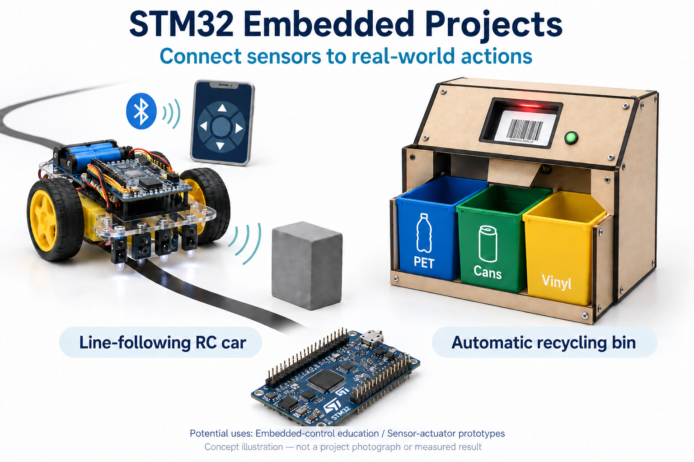
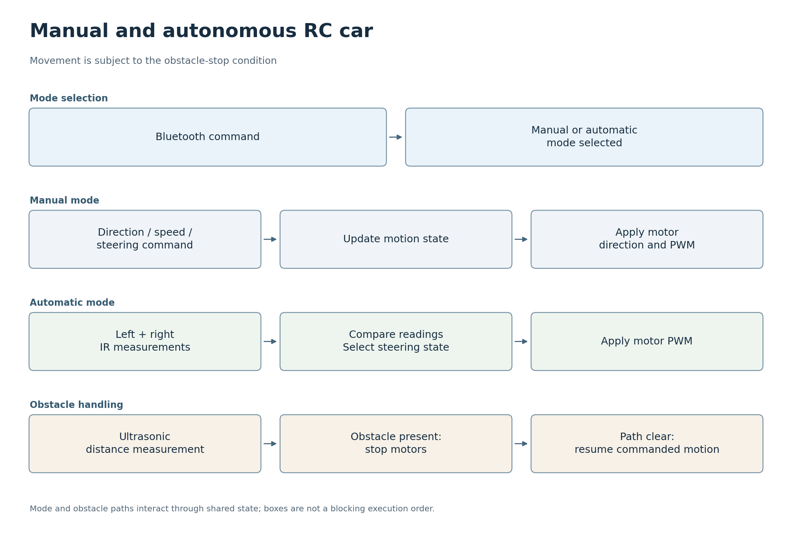
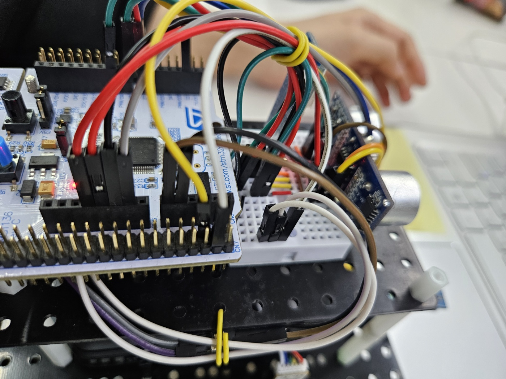
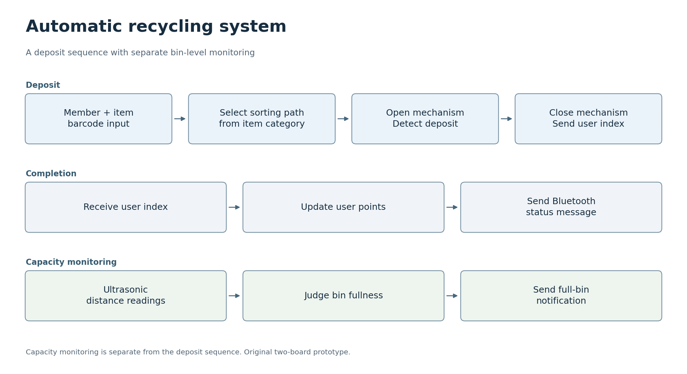
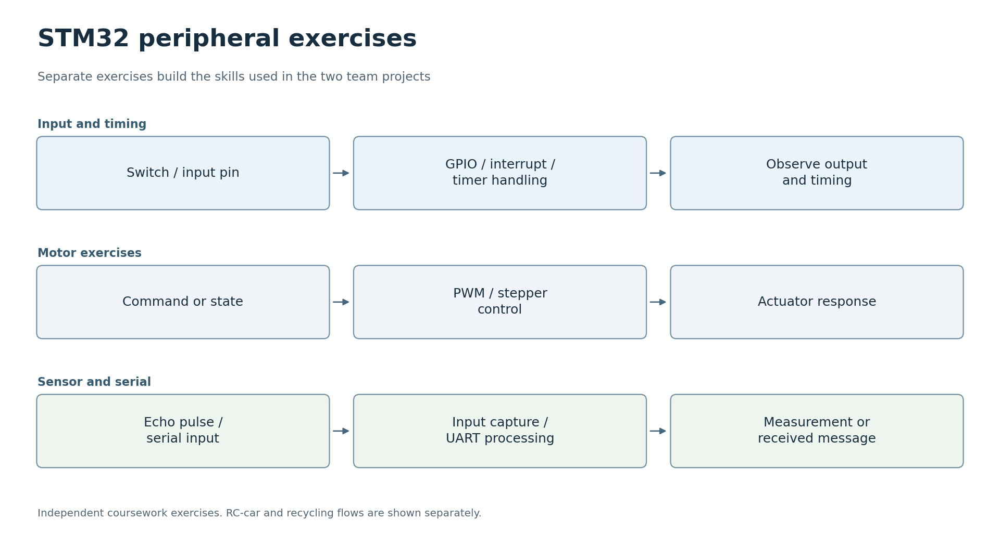

# STM32 임베디드 제어 · 실습에서 두 시제품까지

[한국어](#korean) · [English](#english)

<a id="korean"></a>
## 한국어

2024년 임베디드 컨트롤러 수업에서 STM32F411의 GPIO, 인터럽트, 타이머, PWM, ADC, UART를 하나씩 익힌 뒤, 라인 추종 RC카와 자동 분리수거함으로 연결했습니다. 두 시제품은 같은 질문에서 출발합니다. **센서로 읽은 값을 어떻게 판단하고, 실제 기구의 움직임과 사용자에게 보이는 상태로 바꿀까?**

실습과 두 시제품을 한 과목의 흐름으로 묶은 통합본입니다. 분리수거 앱은 `projects/recycling`에 두고, 실제로 같은 지원 구현만 `lib` 하나로 합쳤습니다.

> 실습과 두 시제품의 코드, 회로와 검증 자료를 함께 살펴볼 수 있습니다. [출처 안내](NOTICE.md) · [통합 근거와 이력](docs/consolidation.md)

### 무엇을 만들었나

| 단계 | 입력과 판단 | 출력과 얻은 경험 |
|---|---|---|
| 주변장치 실습 | 스위치, ADC, 초음파 에코와 타이머 이벤트 | LED, 세그먼트, PWM 모터 제어를 개별 확인 |
| RC카 | 블루투스 명령, 좌우 적외선 반사값, 초음파 장애물 조건 | 수동 이동·속도·조향, 자동 라인 추종, 정지 동작 통합 |
| 자동 분리수거함 | 등록된 사용자·제품 바코드, IR 투입 감지, 수거함 거리 | 분류 경로·투입구 제어, 포인트·상태 메시지, 만재 알림 |



AI로 생성한 개념도이며 실제 장치 사진이나 측정 결과가 아닙니다.

### RC카: 입력을 주행 상태로 연결하기

두 DC 모터, 적외선 반사 센서, 초음파 센서와 블루투스를 결합했습니다. 수동 모드에서는 방향·속도·조향 명령을 받고, 자동 모드에서는 좌우 반사 측정값으로 라인을 따라갑니다. 초음파 입력은 장애물 정지 조건에 사용합니다. 프로그램은 인터럽트에서 센서·통신·모터 상태를 갱신하므로, 보고서의 순서도는 실행 순서를 단순화한 설명입니다.



[벡터 도식](docs/flowcharts/rc-car.svg) · [원보고서 전체 흐름](docs/images/rc-flow-overview.png) · [수동 모드](docs/images/rc-flow-manual.png) · [라인 추종](docs/images/rc-flow-auto.png)



박상헌은 수동 제어와 라인 추종을 구현했고, 김찬중은 하드웨어 배치와 배선을 담당했습니다. 두 팀원은 정지 동작을 함께 개발하고 주행 시험에서 차량을 반복 조정했습니다. 장애물 감지는 공동 개발의 일부이며 개인별 담당 범위는 확인되지 않았습니다.

[RC카 구현·빌드 안내](projects/rc-car/README.md) · [애플리케이션](LAB/LAB_RC_Final.c)

### 자동 분리수거함: 한 번의 투입을 두 MCU로 처리하기

사용자와 물품의 등록 바코드를 읽고, 분류 경로와 투입구를 연 다음 적외선 센서로 투입을 감지합니다. 처리 후 다른 컨트롤러에 사용자 인덱스를 보내 포인트와 완료 상태를 갱신합니다. 두 번째 컨트롤러는 초음파 센서 세 개로 수거함의 남은 공간도 감시합니다. 알려진 바코드에 따른 분류와 거리 기반 만재 표시이며, 무게 측정이나 영상 기반 재질 인식은 아닙니다.



[벡터 도식](docs/flowcharts/recycling.svg) · [보관된 회로 연결도](projects/recycling/docs/images/circuit-diagram.png) · [팀 시연 영상](https://www.youtube.com/watch?v=dkphMHEKzxE)

방준혁은 바코드 기반 회원·재활용품 분류 인식과 UART 송신을 개발했습니다. 박상헌은 스테퍼 모터, 서보 구동 투입구, 적외선 투입 감지를 포함한 투입·분류 순서와 초음파 만재 감지, 사용자 포인트, 블루투스 메시지, LED 상태 표시를 담당했습니다. 두 팀원은 기구 조립, 보드 연결과 통합 시험을 함께 수행했습니다. 업무는 기능별로 나누었으며 한 사람이 한 보드를 전담한 것은 아닙니다.

[분리수거함 구현 안내](projects/recycling/README.md) · [보드 1 앱](projects/recycling/firmware/board-1/app/main.c) · [보드 2 앱](projects/recycling/firmware/board-2/app/main.c)

### 실습과 소스 읽기



[벡터 도식](docs/flowcharts/embedded-labs.svg). 먼저 [PWM/DC 모터 실습](LAB/LAB_PWM_DCmotor_21800275_SangheonPark.c)과 [초음파 입력 캡처 실습](LAB/LAB_Timer_InputCaputre_Ultrasonic_21800275_SangheonPark.c)을 읽고, 같은 입력·출력이 두 시제품에서 어떻게 이어지는지 살펴보면 좋습니다.

개별 실습은 박상헌의 수업 과제입니다. [지원 라이브러리](lib)는 수업 제공 코드와 공동 수정이 섞인 자료이며 전부를 독자 작성했다는 뜻은 아닙니다. RC카와 분리수거 보드 2는 같은 `lib` 구현을 사용합니다. API·타이머 계산 등이 다른 보드 1 지원 코드는 별도로 보존했습니다.

### 결과와 확인 범위

수업 보고서와 보존된 시연에는 등록 사용자·제품 처리, 문 동작, 투입 감지와 만재 알림을 통합한 결과가 기록되어 있습니다. 경사 기구는 둥근 플라스틱 용기와 캔 등을 기준으로 만들었으며 임의의 폐기물이나 다양한 형상을 처리하는 범용 시스템은 아닙니다. RC카는 경로 추종·수동 제어 실습에, 분리수거함은 고정식 기구의 입력·동작 통합 학습에 활용할 수 있습니다. 실제 시설용 신뢰성은 별도 시험이 필요합니다.

```sh
pio run -e rc_car
python projects/recycling/tests/test_source_contract.py
```

RC카는 Nucleo F411RE/CMSIS 타깃입니다. 대체 UART 구현 `ecUART2_simple.c`는 심볼 중복을 피하려고 빌드에서 제외합니다. 기존 ADC 포인터 및 `printf` 자료형 경고는 남아 있습니다. 소스 계약 테스트는 파일 구성·include 연결·일부 개인정보 치환을 검사하며 하드웨어 시험을 대신하지 않습니다. 분리수거 두 보드의 빌드 구성과 검증 경계는 [BUILDING.md](projects/recycling/BUILDING.md)에 있습니다.

분리수거 소스에는 블로킹 지연이 있고, 보드 간 1바이트 사용자 인덱스에는 프레이밍·체크섬·최신성 정보가 없습니다. 보고서와 소스의 핀/UART 표기도 일부 다릅니다. 초음파 세 개를 함께 사용할 때 보고된 오류의 단일 원인은 입증되지 않았습니다. 이번 통합에서 보드에 기록하거나 배선·보정·실물 동작을 재시험하지 않았습니다.

### 출처와 보존

[원본 수업 저장소](https://github.com/oldprize47/Embbadded_Controller_2024)의 이력과 분리수거 저장소 이력을 병합으로 보존했습니다. 사용자 fixture를 치환한 현재 소스도 공동저작·수업 코드의 공개 재배포 허가를 대신하지 않습니다. [파일별 귀속](projects/recycling/ATTRIBUTION.md)과 [통합 경로표](docs/consolidation.md)를 함께 확인하세요.

---

<a id="english"></a>
## English

In the 2024 Embedded Controller course, we first explored GPIO, interrupts, timers, PWM, ADC and UART on the STM32F411, then combined them in a line-following RC car and an automatic recycling prototype. Both ask the same practical question: **how do sensor readings become decisions, physical movement and useful feedback for a person?**

This local integration brings the exercises and both prototypes into one course story. Recycling applications and board records live under `projects/recycling`; only matching support implementations are consolidated into `lib`.

> Explore the coursework, both prototypes, circuit documentation and available validation together. [Attribution](NOTICE.md) · [Integration and history](docs/consolidation.md)

### What we built

| Stage | Inputs and decisions | Outputs and experience |
|---|---|---|
| Peripheral exercises | Switches, ADC readings, ultrasonic echoes and timer events | Individual LED, segment-display and PWM motor exercises |
| RC car | Bluetooth commands, left/right infrared readings and ultrasonic obstacle conditions | Manual movement, speed and steering; automatic line following and stopping |
| Recycling prototype | Registered user/item barcodes, infrared deposit detection and bin distance | Sorting and entrance control, points/status messages and full-bin notification |


AI-generated concept illustration, not a photograph of the device or a measured result.

### RC car: turning inputs into driving states

The car combines two DC motors, infrared reflectance sensors, an ultrasonic sensor and Bluetooth. Manual mode accepts direction, speed and steering commands; automatic mode follows the line using left/right reflectance readings. Ultrasonic input supplies the obstacle-stop condition. The source updates sensors, communications and motor state in interrupt handlers, so the report flowcharts simplify the execution model.


[Vector diagram](docs/flowcharts/rc-car.svg) · [Original report overview](docs/images/rc-flow-overview.png) · [Manual mode](docs/images/rc-flow-manual.png) · [Line following](docs/images/rc-flow-auto.png)


Sangheon Park implemented manual control and line following. 김찬중 arranged the hardware and wiring. Both developed the stopping behaviour and repeatedly adjusted the car during driving tests. Obstacle detection was part of their shared work; its individual attribution has not been confirmed.

[RC implementation and build guide](projects/rc-car/README.md) · [Application](LAB/LAB_RC_Final.c)

### Recycling: handling a deposit across two MCUs

The system reads registered user and item barcodes, opens the sorting path and entrance, then detects the deposit with an infrared sensor. It sends the user index to the other controller to update points and report completion. That controller also reads three ultrasonic sensors to monitor the space remaining in the bins. Classification uses known barcodes, and fullness uses distance; neither weight measurement nor camera-based material recognition is involved.


[Vector diagram](docs/flowcharts/recycling.svg) · [Archived circuit diagram](projects/recycling/docs/images/circuit-diagram.png) · [Team demonstration](https://www.youtube.com/watch?v=dkphMHEKzxE)

방준혁 developed barcode-based member/item-category recognition and UART transmission. Sangheon Park developed the deposit and sorting sequence with stepper motors, the servo entrance and infrared deposit detection, plus ultrasonic fullness detection, user points, Bluetooth messages and LED status indication. Both assembled the mechanism, connected the boards and tested the integrated prototype. Work was divided by function, not by exclusive ownership of a board.

[Recycling implementation guide](projects/recycling/README.md) · [Board 1 application](projects/recycling/firmware/board-1/app/main.c) · [Board 2 application](projects/recycling/firmware/board-2/app/main.c)

### Reading the exercises and source


[Vector diagram](docs/flowcharts/embedded-labs.svg). Start with the [PWM/DC motor exercise](LAB/LAB_PWM_DCmotor_21800275_SangheonPark.c) and [ultrasonic input-capture exercise](LAB/LAB_Timer_InputCaputre_Ultrasonic_21800275_SangheonPark.c), then follow the same inputs and outputs into the prototypes.

The individual labs are Sangheon Park's coursework. The [support library](lib) includes supplied course code and shared modifications, not a claim of sole authorship. The RC car and recycling board 2 use the same `lib` implementation. Board 1 retains its separate support variant because its APIs and timer calculations differ.

### Results and verification limits

The course report and saved demonstration record integrated operation for registered users and products, door movement, deposit detection and full-bin notifications. The sloped mechanism was built around items such as rounded plastic containers and cans; it is not a general waste-recognition system for arbitrary objects. The RC car offers a small platform for path-following and manual-control exercises, while the recycling mechanism demonstrates stationary input/actuator integration. Facility use would require separate reliability testing.

```sh
pio run -e rc_car
python projects/recycling/tests/test_source_contract.py
```

The RC target uses Nucleo F411RE/CMSIS. It excludes the alternative `ecUART2_simple.c` implementation to avoid duplicate symbols. Existing ADC pointer and `printf` type warnings remain. The source-contract tests check source selection, local include closure and selected privacy substitutions; they are not hardware tests. See [BUILDING.md](projects/recycling/BUILDING.md) for recycling source sets and verification boundaries.

Recycling control paths include blocking delays, and the one-byte inter-board user index has no framing, checksum or freshness information. Some report/source pin and UART labels differ. A single cause of the reported errors with three ultrasonic sensors has not been experimentally established. This integration does not include flashing, wiring checks, calibration or renewed physical tests.

### Attribution and preservation

The history of the [original course repository](https://github.com/oldprize47/Embbadded_Controller_2024) and the recycling repository is preserved through a merge. Replacing personal fixtures in current source does not resolve redistribution rights for joint and course code. See [file attribution](projects/recycling/ATTRIBUTION.md) and the [integration map](docs/consolidation.md).
