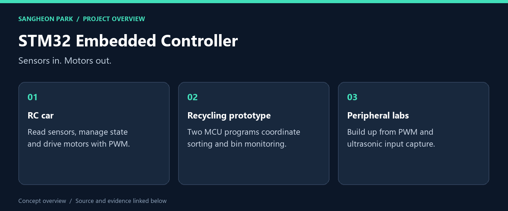
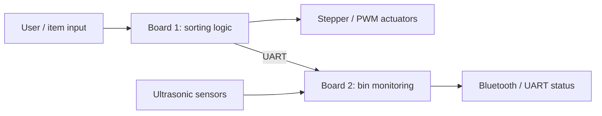
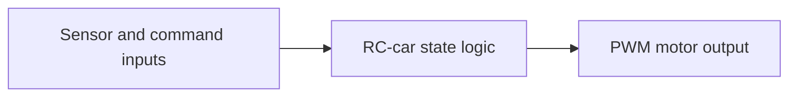

# STM32 Embedded Controller

**I connected sensing, timing and actuator control across individual STM32 labs and two team prototypes.**

[What I built](#what-i-built) · [My role](#my-role) · [Code and reproduction](#code-and-reproduction) · [Portfolio](https://github.com/oldprize47-SH)

## What I built

| Deliverable | What it does | Explore |
|---|---|---|
| **RC-car controller** | Sensor processing, state logic and motor output | [Source / result](LAB/LAB_RC_Final.c) |
| **Recycling system: board 1** | UART input, stepper actuation and PWM output | [Source / result](LAB/final_first_board.c) |
| **Recycling system: board 2** | Ultrasonic timing and Bluetooth/UART status output | [Source / result](LAB/final_second_board.c) |

### Result at a glance

Team prototype demonstrated; this archive has not been rebuilt or flashed in the portfolio pass.

**[▶ Watch the original team demonstration](https://www.youtube.com/watch?v=dkphMHEKzxE)**

The linked video is the team’s original demonstration, not a newly recorded test.

## My role

The individual labs and team projects have different authorship scopes. My coursework covered peripheral configuration and motor/sensor exercises; the RC car and recycling system are team work. Course-library and partner contributions remain credited by their source history.

## How the embedded projects work

### Recycling prototype — divide the work across two controllers

### RC car — connect sensor readings to motor output

**Embedded concepts demonstrated:** peripheral configuration, interrupt-driven timing,
sensor input processing, state-dependent actuation and serial communication.
The individual peripheral labs provide smaller entry points before reading the team applications.

## Code and reproduction

## What to inspect

Trace a sensor input through its interrupt or polling path, then follow the state
and PWM output. Compare the individual labs with the integrated final projects.

[Recycling-system team demo](https://www.youtube.com/watch?v=dkphMHEKzxE)

## Verification boundary

This public archive does not contain the complete board build configuration.
A related local RC-car workspace compiled on 2026-09-28, but that result is **not**
claimed for this different source snapshot. This fork has not been freshly built,
flashed or exercised on hardware. Board support, original wiring and the course
library/toolchain must be reconciled before attempting a hardware replay.

## Source and credits

[Original repository](https://github.com/oldprize47/Embbadded_Controller_2024) · [Portfolio home](https://github.com/oldprize47-SH)

[Original README](README.original.md) is retained alongside the source history.

Course scaffolding, team contributions and third-party assets retain their original attribution. This documentation does not grant a new licence.
